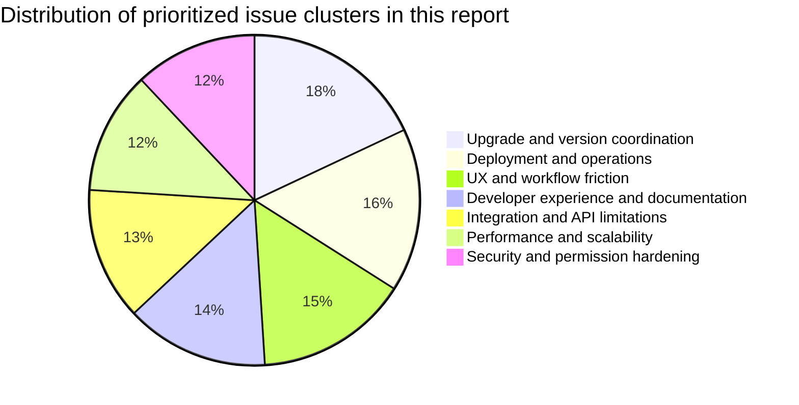
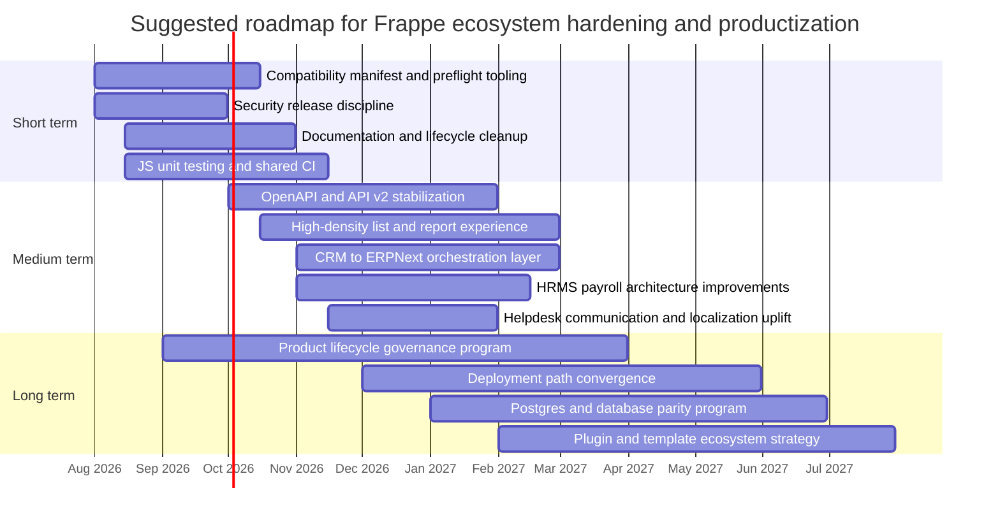

# Frappe Ecosystem Deep Research Report

> [!info] Vault context — external competitive/predecessor intelligence, imported + indexed 2026-07-30.
> This report **corroborates and expands the pains that drove Frust**: the OpenAPI/API gap, list/report perf at scale, permission complexity, Bench/Docker/Helm deployment friction, security-depends-on-rapid-upgrades, and bench-shared multi-tenancy all map to existing pain points. See [[Frappe Pain Points]] (P-x.x), [[SRS]] (REQ-x.x.x), [[v1.0 Pain-Point Scorecard]] (verdicts), and the [[Research Index]] (findings→Frust mapping). · [[Frust Hub]]

## Executive summary

Frappe remains a strong, unusually productive application platform: the core framework is mature, the ERP suite is large, and the official product line now spans ERPNext, HRMS, CRM, Helpdesk, Insights, Builder, LMS, Wiki, Drive, Education, Payments, and more. But the ecosystem has also become operationally and governance-wise more complex because functionality has been split across many repositories, deployment paths, and release trains. Frappe’s own organization currently exposes 217 repositories, while the official docs navigation presents a broad product family rather than a single monolith. That expansion is good for specialization, but it increases version-coordination, migration, and ownership risk.

The most important constraint is not a single “fatal flaw,” but an accumulation of platform-friction around upgrades, app compatibility, security patching, deployment topology, and inconsistent maturity across apps. Recent upgrade documentation for v16 raises core dependency floors to Python 3.14+ and Node 24+, and the ecosystem shows repeated evidence of split-app migration pain: modules formerly bundled in ERPNext moved into separate apps in v14, LMS had a documented v15→v16 Docker regression where the stable image lacked the app, Education users reported v16 compatibility lag, and India Compliance users reported branch/version mismatches during installation.

Security posture is active, but it is upgrade-dependent. In 2025–2026, Frappe published advisories covering SQL injection, path traversal/arbitrary file read, reportview permission bypass, authorization bypass, user enumeration, and a TarSlip RCE in package import. That is evidence of responsive maintenance, not negligence; however, for operators it means “stay current or accept material risk,” especially because several advisories list upgrade as the only remediation.

The highest-return roadmap is therefore straightforward. In the short term, Frappe should reduce ecosystem risk with a first-class compatibility manifest, mandatory migration preflight checks, security-bundle releases, and a test/documentation uplift. In the medium term, it should close the largest UX and integration gaps: list/report views at scale, OpenAPI/API discoverability, CRM↔ERPNext pipeline continuity, and payroll/helpdesk/LMS workflow gaps. In the long term, it should simplify operations and governance by converging release engineering across official apps, hardening deployment tooling, and clarifying lifecycle/ownership expectations for incubating or community-owned apps.

## Scope and methodology

This report interprets “Frappe ecosystem apps” pragmatically. It covers the Frappe framework itself, ERPNext, major official apps in the Frappe organization and documentation tree, deployment tooling maintained by Frappe, and a small number of high-impact ecosystem extensions where operational relevance is disproportionate to their repository count. That means the report is not an exhaustive census of every private, regional, or low-adoption Frappe app on GitHub or on the Marketplace; instead, it focuses on the products most likely to shape technical decisions, upgrade risk, and production outcomes for serious adopters. This is consistent with the breadth of Frappe’s official docs catalog and the scale of the organization’s repository footprint.

The source hierarchy was deliberately conservative. Primary and near-primary sources were weighted highest: official docs, official GitHub repositories, official security advisories, official migration guides, and official marketplace documentation. Those were then triangulated with GitHub issues and Frappe forum posts to identify recurring pain points and distinguish isolated bugs from structural constraints. Where community posts were used, they were treated as evidence of recurring operator pain or governance perception, not as sole proof of technical fact.

Issue prioritization in the tables below uses a qualitative score, not a literal issue-count rank. “Frequency” reflects repetition across repositories, forum threads, or multiple major apps. “Severity” reflects likely business impact: production outage, security exposure, blocked upgrade, core workflow failure, or major support burden. “Effort” and “Impact” in the roadmap are report estimates intended for planning, not official commitments.

A few assumptions are important. Repository stars and open-issue counts are point-in-time snapshots from late July 2026. Some issue trackers restrict issue creation or show moderation artifacts, so raw counts were not used alone. The ecosystem also contains products with materially different lifecycle states: for example, Studio explicitly warns it is not production-ready, Drive is marked beta and was archived in July 2026, and Non Profit was archived in July 2025. Those lifecycle differences matter as much as defect counts.

## Ecosystem coverage and portfolio health

The portfolio below captures the apps and tools that most meaningfully affect architecture, upgrades, or operational risk. It combines official products, framework/runtime tooling, and a few ecosystem apps with outsized real-world importance.

| Product | Role in ecosystem | Current signal | Why it matters to enterprise adopters |
|---|---|---|---|
| **Frappe Framework** | Core application framework | 10.5k stars; about 2.2k open issues; MIT license. | Every app inherits its database/API/security/model/view conventions, so framework limitations propagate outward. |
| **ERPNext** | Core ERP suite | 37.4k stars; about 1.8k open issues; GPL-3.0. | Largest installed base; upgrade and workflow assumptions usually anchor the rest of the stack. |
| **HRMS** | HR and payroll app split from ERPNext | 8.3k stars; about 431 open issues; GPL-3.0. | Payroll/legal workflows are high-stakes; split-app compatibility is especially important here. |
| **CRM** | Modern standalone CRM | 3.0k stars; about 237 open issues; AGPL-3.0. | Strategic because ERPNext docs now tell new CRM implementers to evaluate Frappe CRM before investing in ERPNext CRM customizations. |
| **Helpdesk** | Support/ticketing | 3.3k stars; about 146 open issues; AGPL-3.0. | Common “adjacent” app for ERP/CRM buyers; documentation and localization gaps are material. |
| **Insights** | BI and reporting | 973 stars; about 199 open issues; AGPL-3.0. | Important because reporting pain in core Frappe/ERPNext often pushes buyers toward external analytics. |
| **Builder** | Website/page builder | 2.2k stars; about 54 open issues; MIT. | Important for no-code/website use cases, but still developing ecosystem assets and maturity. |
| **LMS** | Learning platform | 3.1k stars; about 80 open issues; AGPL-3.0. | Shows both modern product ambition and versioning/deployment fragility. |
| **Education** | School/university management | 586 stars; about 114 open issues. | Important for institutions, but tracker hygiene and compatibility signal are weaker than top-tier apps. |
| **Payments** | Payment gateways and payment requests | 172 stars; about 67 open issues; MIT. | Critical dependency for web forms, checkout, and several business workflows. |
| **Wiki** | Knowledge base/documentation app | 421 stars; about 23 open issues; MIT. | Lower operational risk than ERP apps, but relevant for internal documentation and KB use cases. |
| **Drive** | File storage/collaboration | 733 stars; about 57 open issues; AGPL-3.0; beta; archived July 3, 2026. | Important as a cautionary example of product-lifecycle risk inside the portfolio. |
| **Bench** | Core CLI/deployment tool | about 1.7k stars; 141 open issues; GPL-3.0; maintainers are also building a simplified successor. | Bench complexity directly affects onboarding, upgrades, and CI/CD. |
| **Helm** | Official Kubernetes deployment chart | 190 stars; open issue tracker remains active. | Relevant for cloud-native adopters, but operational complexity remains high. |
| **frappe_docker** | Official container deployment repo | Official container setup for Frappe apps. | Recommended path for production by Bench README, but still a source of versioning and image-build friction. |
| **India Compliance** | High-impact regional ecosystem app | 251 stars; about 101 open issues; GPL-3.0. | A useful example of critical regional functionality living outside the core org with its own release train and compatibility burden. |

Two portfolio-level patterns stand out. First, official app count has grown faster than cross-app lifecycle simplification. The result is a “platform of products,” not a single artifact. Second, maturity is uneven: some apps are clearly core and battle-tested, some are scaling rapidly, and some are effectively incubating or transitioning ownership. The starkest examples are Drive’s archived status despite prominent positioning, Non Profit’s archived repo, Studio’s explicit early-stage warning, and Marley Health’s transfer of ownership to Earthians.

That unevenness matters operationally because buyers often assume “official docs presence” implies comparable support and lifecycle guarantees. In practice, the portfolio currently behaves more like a federation with different maturity bands, maintainership rhythms, and compatibility edges. Marketplace rules help somewhat by requiring open-source licensing and support for the current stable Frappe/ERPNext version, but they do not eliminate quality variance.

## Technical issues and platform limitations

The most consequential technical issues are clustered, not isolated. Security fixes concentrate risk into upgrade urgency; performance pain concentrates in report/list views and large datasets; deployment pain concentrates in Bench/Docker/Helm/version coupling; and productization pain concentrates in cross-app coordination and migration ergonomics. The chart below summarizes the distribution of the prioritized issue clusters in this report’s evidence set, which was built from official issue trackers, advisories, migration guides, and repeated forum signals.

| Priority cluster | Frequency | Severity | Representative evidence | Suggested fix |
|---|---|---|---|---|
| **Upgrade and migration breakage across split apps** | Very high | Critical | Frappe’s v16 migration notes raise Python and Node floors; ERPNext v14 split many domains out into separate apps; forum threads document missing modules after upgrades; LMS had a stable-image v15→v16 outage because the app was absent; Education users reported v16 compatibility lag; India Compliance installs have failed on branch/version mismatches. | Publish an official **ecosystem compatibility manifest** and a `bench preflight-upgrade` command that checks branch parity, required companion apps, removed modules, migration blockers, and dependency floors before anything touches production. |
| **Security posture depends heavily on rapid upgrades** | High | Critical | 2025–2026 advisories include SQL injection, path traversal/arbitrary file read, reportview permission bypass, auth bypass, user enumeration, and a TarSlip RCE, with several listing upgrade as the only fix. | Move to a predictable **security release train** across all official apps, publish machine-readable advisories, and make Cloud/Bench surface “security minimum version” alarms prominently. |
| **Authorization and permissions remain hard to reason about** | High | High | Recent advisories hit permission checks; community threads describe user-permission semantics as risky or unintuitive; ERPNext still receives permission-fix issues in core workflows. | Introduce a permissions auditor, “effective access” explainer UI, stricter defaults for user permissions, and regression test packs for permission-sensitive endpoints. |
| **List/report view performance and usability degrade at scale** | High | High | Requests for more columns and horizontal scrolling continue; report view has had double-scrolling regressions; mobile report view remains cramped; large-data forum threads continue; bulk delete has historically hung because jobs and reportview calls interact poorly. | Build a new **high-density table mode** with virtualized columns/rows, better mobile breakpoints, query profiling hooks, and a clear distinction between list view and analytic report workloads. |
| **Performance/scalability guidance is still mostly vertical-first** | Medium | High | Official optimization docs recommend starting with strong RAM/IOPS, scaling vertically as long as possible, and only then adding replicas; the framework supports read replicas, but distributed scale is not the primary path. | Provide clearer reference architectures for 10M+ row and multi-region deployments, including observability defaults and tested “large instance” patterns. |
| **Bench/Docker/Helm operations remain complex and failure-prone** | Very high | High | Bench is *nix-only and shared-config by bench; official Docker and Helm exist, but issue threads document install failures, missing apps, image/version confusion, custom-image regressions, storage/runtime issues, and upgrade uncertainty. | Converge official deployment paths around a smaller number of **blessed reference architectures**, with parity-tested sample stacks and automated smoke tests per official app. |
| **API discoverability and versioning are still weaker than they should be** | High | High | Frappe exposes REST, token auth, OAuth 2, OpenID Connect, and webhooks, but the longstanding request for automatic OpenAPI generation remains unresolved, and API v2 stabilization is still open. | Ship native **OpenAPI generation**, versioned contracts, and SDK examples. Make API v2 a published compatibility target, not just an issue-tracker aspiration. |
| **Cross-app workflow seams are real product blockers** | High | High | Frappe CRM integrates with ERPNext to create quotations and customers from deals, but users continue to request an automated, linear sales pipeline between the two; procurement/supplier workflows are also missing. | Create a formal **cross-app orchestration layer** for lead→deal→quote→order→invoice and parallel buyer/supplier flows, with evented synchronization and reconciliation tooling. |
| **Database-engine parity is incomplete** | Medium | Medium to High | Frappe docs still describe Postgres support as beta, while the framework maintains `multisql` and app ecosystems continue to carry MariaDB-first assumptions; regional apps are still explicitly testing Postgres support. | Publish an app-by-app **database compatibility matrix** and CI requirement for official apps to test both MariaDB and Postgres before release labels are cut. |
| **Maturity variance inside the official portfolio creates hidden risk** | Medium | High | Drive is beta and warns self-hosters not to rely on it as their only file store, yet the repo was archived in July 2026; Studio is explicitly not production-ready; Non Profit is archived. | Add explicit lifecycle labels — **stable, growing, beta, community-owned, archived** — in docs, repos, and Marketplace to align buyer expectations with reality. |

The single biggest technical takeaway is this: the current bottleneck is ecosystem coordination more than raw framework capability. Frappe can do a very large amount technically, but production safety depends on making version compatibility, app lifecycle, and deployment assumptions much more explicit than they are today.

## UX, workflow, integration, and feature gaps

The UX story is strongest in modern apps built on Vue and Frappe UI, but the overall ecosystem still mixes an older Desk/jQuery SPA model with newer frontends. Frappe’s framework docs still describe the client side as a JavaScript SPA built with jQuery, while modern flagship apps such as CRM, LMS, Insights, Builder, and Education explicitly lean on Vue/Frappe UI. That stack heterogeneity likely contributes to UX inconsistency, extension complexity, and uneven frontend testability.

A second major UX issue is transition uncertainty in customer-facing workflows. ERPNext’s own docs now warn new CRM implementations to evaluate Frappe CRM, and they note a planned version 17 transition in which existing CRM custom behavior should not be assumed to move automatically. That is strategically correct if CRM is becoming a dedicated product, but it creates immediate migration and product-design ambiguity for anyone heavily customized on ERPNext CRM today.

The recurring feature requests below are the strongest candidates for medium-term product work because they represent either repeated high-friction gaps or missing capabilities that prevent adoption in real production workflows.

| App or area | Common requests and limitations | Why it matters | Suggested direction |
|---|---|---|---|
| **Core Frappe / ERPNext** | Native OpenAPI/Swagger; stable API v2; more flexible list/report views; mobile report usability; nested child tables; clearer permission semantics. | These are platform multipliers: they affect every app and every integration. | Treat them as framework platform investments, not app-level requests. |
| **CRM** | Native tags and multiselect; automated CRM↔ERPNext sales pipeline; supplier/procurement workflows; contracts; manual sync controls for ERPNext items; sales hierarchy usability/documentation gaps. | CRM is becoming strategic; adoption stalls if commercial workflows require custom glue. | Build an evented orchestration model and deeper ERPNext object mapping. |
| **Helpdesk** | Better docs; multilingual support; ticket CC recipients; searchable canned responses; more email template controls; general missing functionality reports. | Support teams need polished portal UX and localization; otherwise they outgrow the product quickly. | Create a “customer communications” milestone with portal search, CC, templating, and i18n parity. |
| **HRMS** | Scheduled payroll; flexible payroll without rigid salary-structure dependence; multiple tax slabs; easier salary-component changes; payroll regression fixes. | Payroll is legally sensitive; workarounds are expensive and risky. | Prioritize payroll architecture over cosmetic HR improvements. |
| **Insights** | Visual query builder parity with classic builder; drill-down pagination and correct counts; clearer column limits; broader data-source ergonomics. | BI adoption lives or dies on drill-down usability and non-technical-builder confidence. | Add a “semantic reporting” backlog focused on pagination, data density, and reusable metrics. |
| **Builder** | Template/theme marketplace; easier install path; more reusable design assets; maturation of Builder Hub. | Builder’s value increases sharply when design assets are portable and community-shareable. | Productize Builder Hub as the official template/plugin distribution mechanism. |
| **LMS** | Recurring live classes; richer quiz/audio/H5P support; LTI 1.3; SCORM export; upload progress; payment retry robustness; more interoperable meeting tools. | Education and enterprise training buyers expect interoperability and richer assessments. | Shift LMS roadmap toward standards support and media/assessment robustness. |
| **Education** | Native multi-school/multi-branch support; v16 compatibility confidence; issue-tracker hygiene. | Multi-campus support is a common real-world requirement; spam/noise lowers trust. | Add branch-aware data model and stronger repo moderation/triage. |
| **Payments** | Gateway UI clarity and reliability; newer/safer API design; clearer docs for install and portal/payment request flows. | Payment path failures have immediate revenue impact. | Complete the new API design and improve gateway observability. |

Across the portfolio, the deepest pattern is not “missing everything,” but “missing the last 20% that turns a promising app into a default enterprise choice.” That is especially true for CRM, Helpdesk, HRMS payroll, and LMS interoperability. Those product gaps are all bridgeable, but they require sharper scope discipline than the ecosystem has sometimes shown.

## Developer experience, deployment, governance, and legal constraints

Developer experience is productive once a team is already inside the Frappe way of working, but onboarding and long-term maintenance are still rougher than they should be. Official install docs now require a fairly modern stack and officially support only macOS and Debian/Ubuntu on *nix, with Windows directed toward WSL. Bench itself is explicitly a *nix CLI, and its maintainers are now working on a simplified successor, which is a strong signal that the current developer/deployment workflow is too complex for part of the market.

Testing is another clear gap. Official UI testing docs still center Cypress, and a February 2026 feature request explicitly calls out the absence of JavaScript unit testing infrastructure as a framework-level problem. The lack of a first-class JS unit-testing story matters because the app portfolio is increasingly frontend-heavy. At the same time, documentation is split across modern docs, product docs, GitHub READMEs, and old wiki pages — and some older wiki pages remain searchable with outdated dependency assumptions, which can easily confuse newcomers.

| Deployment model | Strengths | Main constraints | Best fit |
|---|---|---|---|
| **Manual Bench on self-hosted Linux/macOS** | Maximum control; native multi-tenancy; common path for custom apps. | *nix-only; app/dependency/version management is manual; all sites on a bench share bench-level app/dependency configuration. | Teams with in-house Linux/Frappe operations expertise. |
| **Official Docker** | Official container path; Bench now recommends Docker for production; good base for custom images. | Image/build/version coordination still causes real issues; upgrade path has been a recurring pain point; “disposable demo only” shortcuts are not production substitutes. | Small-to-medium self-hosters who can standardize on containers. |
| **Official Helm/Kubernetes** | Official chart exists; useful for cloud-native teams. | Chart/runtime/storage/custom-image quirks remain non-trivial; issue history suggests operational sharp edges. | Organizations already strong in Kubernetes. |
| **Frappe Cloud public/shared benches** | Fastest path to value; low ops burden. | Custom apps and server scripts are constrained; shared-bench/group trade-offs apply. Server scripts are disabled by default on shared benches for security. | Evaluation, smaller deployments, standard stacks. |
| **Frappe Cloud private benches** | More control; can install custom apps; SSH available. | Still on shared servers unless moved to Servers; SSH certs are short-lived and SCP/VS Code over SSH are not supported. | Teams wanting managed hosting plus custom code. |
| **Frappe Cloud dedicated Servers** | Dedicated compute/resources; clearer isolation. | Higher cost/complexity; migration planning still needed. In-place updates are experimental. | Regulated or performance-sensitive deployments that still want managed tooling. |

Governance constraints are now material. The official portfolio spans many repos, and a few products show lifecycle ambiguity that should be made much more explicit. Drive is beta, warns self-hosters not to use it as the sole file store, and is archived. Non Profit is archived and read-only. Education’s issue tracker is restricted yet still shows obvious spam posts. Community perception also shows tension around issue auto-closing and triage transparency. None of that means the ecosystem is unhealthy overall, but it does mean buyers should distinguish between “officially listed,” “actively strategic,” “community-owned,” and “maintenance mode.”

Licensing and legal structure are favorable for open-source adoption but require attention. Frappe Framework, Builder, Wiki, and Payments use MIT licenses, which are permissive. ERPNext and several other classic business apps use GPL-3.0. CRM, Helpdesk, LMS, Insights, and Drive use AGPL-3.0, which raises the legal importance of network-use/source-disclosure questions for modified deployments. Frappe Cloud Marketplace requires apps to be open source and either MIT or GPL-compatible, supports paid app plans, and applies an economic model in which Frappe Cloud takes the first $500 of app revenue and then splits revenue 80/20; for publishers outside India, PayPal is currently the only payout method documented. ERPNext also maintains a separate trademark policy, which is a reminder that open-source code rights and trademark rights are not the same thing. This is not legal advice; teams building proprietary extensions around AGPL/GPL apps should get counsel.

## Actionable roadmap

The roadmap below is designed for an organization with no hard budget cap and a willingness to invest where leverage is highest. It is intentionally biased toward changes that reduce ecosystem-wide friction rather than one-off app fixes. The short-term priority is to reduce operational risk. The medium-term priority is to improve adoption-critical workflows. The long-term priority is to simplify the portfolio and make lifecycle expectations explicit.

| Horizon | Action | Estimated effort | Expected impact | Why it should come first |
|---|---|---:|---|---|
| **Short term** | Publish an **official compatibility manifest** for framework/app/database/Node/Python combinations, including split-app dependencies and Frappe Cloud support status. | 4–6 team-weeks | Very high | Directly reduces failed upgrades, install confusion, and support burden. |
| **Short term** | Add `bench preflight-upgrade` and `bench preflight-install` checks for branch parity, required companion apps, removed modules, security minimum versions, and deprecated hooks. | 6–8 team-weeks | Very high | Stops breakage before production. |
| **Short term** | Create a **security LTS discipline**: batched advisories, machine-readable version minimums, and Cloud banners for critical patch gaps. | 3–5 team-weeks | Very high | Recent advisories show that operators need clearer, faster action signals. |
| **Short term** | Establish a **docs modernization sweep**: remove or banner outdated wiki pages, consolidate installation paths, and add per-app lifecycle badges. | 4–6 team-weeks | High | Documentation fragmentation and lifecycle ambiguity are avoidable own-goals. |
| **Short term** | Add first-class **JavaScript unit testing** and shared CI templates for official apps. | 6–10 team-weeks | High | Necessary because the portfolio is increasingly frontend-heavy. |
| **Medium term** | Deliver native **OpenAPI generation**, publish API version guarantees, and officially stabilize API v2. | 8–12 team-weeks | Very high | Unlocks integrations, SDKs, testing, and enterprise procurement confidence. |
| **Medium term** | Rebuild **list/report view for scale** with virtualization, high-density columns, mobile-specific layouts, and profiling hooks. | 10–16 team-weeks | Very high | This addresses some of the most repeated workflow complaints across Frappe/ERPNext. |
| **Medium term** | Build a formal **CRM↔ERPNext orchestration layer** for sales and supplier flows. | 10–14 team-weeks | Very high | High adoption leverage because CRM transition is strategic. |
| **Medium term** | Prioritize **payroll architecture** improvements in HRMS: scheduled payroll, flexible components, tax-slab support, regression defenses. | 8–12 team-weeks | High | Payroll friction is expensive, risky, and very visible to buyers. |
| **Medium term** | Improve **Helpdesk communications and localization**: multilingual parity, CC recipients, canned response search, notification templates. | 6–9 team-weeks | High | Converts Helpdesk from promising to production-default for more teams. |
| **Long term** | Rationalize portfolio governance with explicit states: stable, strategic, growing, community-owned, archived, experimental. | 3–4 team-weeks plus ongoing governance | High | Clarifies procurement and maintenance expectations. |
| **Long term** | Converge official deployment engineering around fewer, deeply tested reference paths and app image pipelines. | 10–14 team-weeks | High | Lowers the cost of operating many official apps. |
| **Long term** | Pursue **database parity** across official apps and make Postgres support a measurable release gate rather than a soft aspiration. | 12–20 team-weeks | High | Important for enterprise buyers who want database flexibility. |
| **Long term** | Create an **extension platform** for Builder/LMS/CRM templates, plugins, and partner-maintained capabilities with compatibility validation. | 12–18 team-weeks | Medium to high | Scales the ecosystem without forcing everything into core repos. |

The roadmap can be visualized as an overlapping delivery program rather than a strict waterfall. Short-term work should start immediately because it is mostly enabling infrastructure; medium-term work can begin once compatibility and test foundations are in place; long-term work should start as governance and platform engineering tracks that run in parallel with product delivery.

If a leadership team can fund only a subset, the highest-value bundle is this one: compatibility manifest, preflight upgrade tooling, security minimum-version enforcement, JS unit-testing uplift, OpenAPI/API stabilization, and a CRM↔ERPNext orchestration layer. That bundle addresses the largest combination of outage risk, integration friction, buyer confidence, and portfolio coherence. It would not solve every app-level problem, but it would materially improve the ecosystem’s reliability and commercial competitiveness within one major planning cycle.