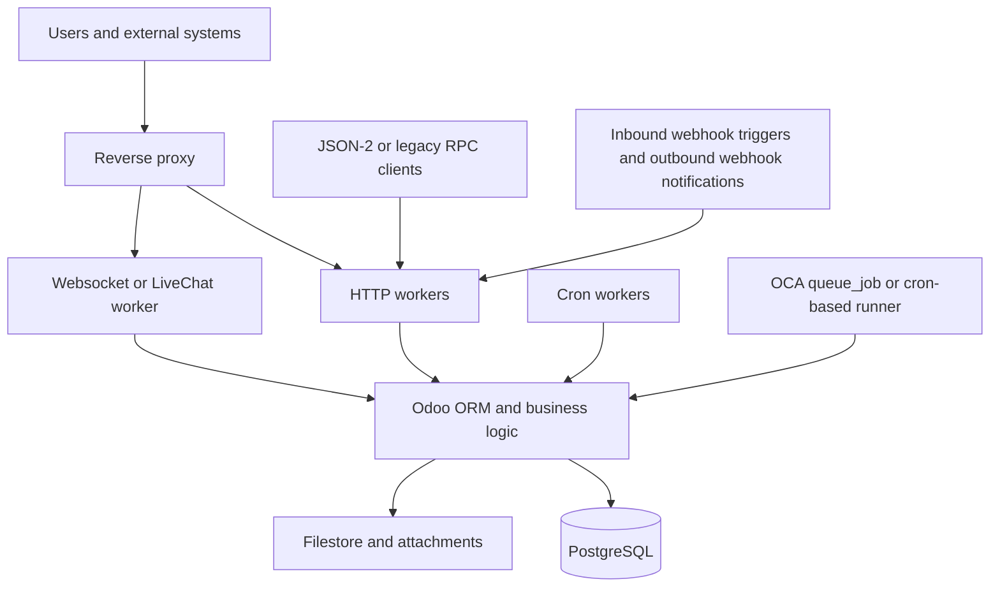
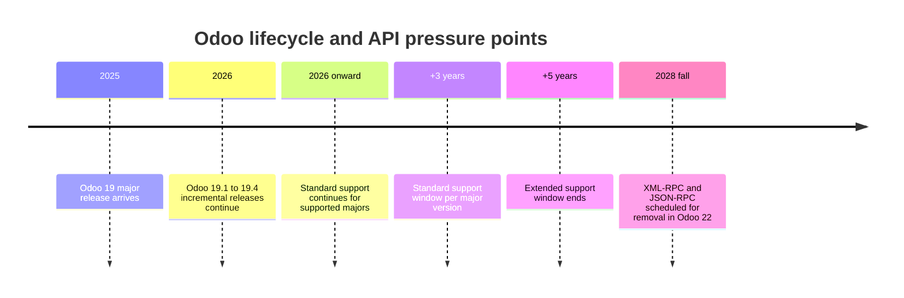

# Odoo Ecosystem Deep Research Report

> [!info] Vault context — competitive intel on the other major open-source ERP, imported + indexed 2026-07-30.
> Several Odoo constraints are ceilings **Frust has already measured against**: GIL/single-thread (Frust's GIL is gone — the single-thread loop was the *new* ceiling, killed in WO-025), no first-party async queue (Frust ships a native queue + ADR-010 worker ladder), raw-SQL/`sudo()` ACL bypass (Frust's permissions are DB-enforced with no bypass surface), 20-minute large-table valuation (Frust's rollup ladder + 1 M-row floor), and multi-company correctness risk (Frust's tenancy isolates by provenance, WO-040). See [[Frappe Pain Points]], [[v1.0 Pain-Point Scorecard]], and the [[Research Index]] (findings→Frust mapping). · [[Frust Hub]]

## Executive summary

As of July 30, 2026, Odoo is best understood as a powerful but opinionated integrated suite whose strengths come from a shared data model and modular application stack, and whose weaknesses come from the same design choices: heavy ORM use, deep coupling between custom modules and upgrades, uneven app quality outside official modules, and deployment trade-offs that materially change what is feasible operationally. Odoo 19 is already shipping SaaS-style incremental releases up through 19.4, which reinforces that buyers are not selecting a single static version so much as entering a continuously evolving product and ecosystem.

The most important structural constraints are not cosmetic. Odoo’s official production guidance still centers on PostgreSQL-backed multiprocessing, reverse proxies, worker sizing, cron threads, and disciplined `dbfilter` use. The default multithreaded server remains simpler but is limited by Python’s GIL; production on Linux is steered toward multiprocessing; and Windows is explicitly outside that recommended production posture. On the cloud side, Odoo Online removes a great deal of infrastructure burden but forbids custom modules, while Odoo.sh enables custom code yet still imposes platform constraints such as no direct system-package installs and an Enterprise subscription requirement.

Functionally, Odoo covers the breadth of an ERP very well, but depth varies sharply by domain and by jurisdiction. Accounting officially supports more than 100 countries, yet localization coverage is explicitly still being expanded; payroll depends on country-specific localization modules; and enterprise deployments with high transaction volume continue to show recurring stress in inventory valuation, stock moves, manufacturing confirmations, POS offline resilience, and some multi-company reporting edges. These are not hypothetical risks: current and historical GitHub issues show concrete examples such as 20-minute valuation reports on large databases, 20+ minute picking validation with 5,000 move lines, 5–21 second stock transactions with 20 million valuation layers, manufacturing confirmations exceeding 21 minutes, and a 2026 POS IndexedDB corruption bug that can crash boot without self-recovery.

The integration story is in transition. Odoo 19 introduces JSON-2 as the forward-looking external API, while both XML-RPC and JSON-RPC are scheduled for removal in Odoo 22. JSON-2 is materially better aligned with modern HTTP usage, but each call still runs in its own SQL transaction, which means many business workflows remain orchestration-heavy unless teams build custom service endpoints. First-party GraphQL support was not specified in the official 19.0 references reviewed. In practice, serious Odoo estates still rely heavily on OCA connector, queue, REST, and FastAPI components, plus partner-built connectors and marketplace apps.

The marketplace is large and useful, but governance is mixed. Odoo’s Apps Store has formal vendor guidelines, refund responsibilities for paid apps, anti-lock-in rules, and sanctions up to unpublishing. At the same time, store ranking criteria are relatively shallow, support is mandatory for paid apps but not for free ones, and quality assurance still depends heavily on the author. OCA generally provides the strongest community governance, especially around CI, pre-commit hooks, migration work, and reusable frameworks such as OpenUpgrade and queue/job tooling, but OCA itself carries annual version-maintenance overhead and volunteer capacity limits.

The actionable conclusion is straightforward. If the priority is speed and low operations burden, choose Odoo Online only when no custom Python modules are needed. If the priority is Enterprise customization with official platform support, choose Odoo.sh but design around its restrictions. If the priority is scale, specialized integrations, advanced observability, or cloud portability, self-host or use a managed provider and assume responsibility for DevOps, backup discipline, performance tuning, and upgrade rehearsal. In all three paths, the biggest determinant of success is not “Odoo vs. non-Odoo” but governance around customizations, data volume, app selection, and upgrades.

## Methodology and prioritized sources

This report prioritizes primary and near-primary sources, then uses community evidence and vendor material to fill operational gaps. The weighting reflects a simple rule: official Odoo documentation and official source repositories define intended behavior; GitHub issues and OCA repositories reveal how that behavior degrades under real conditions; forums and Stack Overflow show recurring operator pain; and vendor/provider material is used mainly for deployment economics, representative case studies, and ecosystem positioning.

| Source tier | Priority | Why it matters | Representative evidence |
|---|---|---|---|
| Odoo official docs, legal terms, release notes | Highest | Defines supported architecture, hosting, APIs, editions, upgrades, and support lifecycle | Deployment, upgrade, API, licensing, and release-note pages. |
| Odoo official GitHub repo and security archive | Very high | Shows live defect patterns, issue volume, CVEs, and contribution constraints | Open issues count, current bug examples, security advisories, contribution rules. |
| OCA repos and OCA Apps Store | Very high | Best evidence for community-maintained upgrade paths, async jobs, REST/FastAPI, CI discipline, and reusable patterns | OpenUpgrade, queue_job, rest-framework, maintainer-tools. |
| Odoo forum and Stack Overflow | Medium | Best for identifying recurring implementation traps and operator confusion, especially permissions, APIs, and performance sizing | Worker sizing discussions, ACL confusion, multi-db and XML-RPC pain. |
| Hosting providers and integrators | Medium | Useful for deployment trade-offs, managed-service models, and non-official but common ecosystem patterns | Cloudpepper, Dynapps, VentorTech, Captivea. Treat as directional, not neutral. |

The research covered official Odoo 19 documentation, current July 2026 GitHub issues, OCA repositories and app pages, official edition and pricing pages, official support/legal pages, representative partner and hosting-provider material, and selected community discussions. Where the official record did not specify a fact, this report marks it as **unspecified** rather than inferring beyond the evidence.

## Architecture and technical constraints

Odoo’s architectural center of gravity is a multitier Python application talking to PostgreSQL, with modules extending both server-side business logic and client-side web behavior. That architecture remains elegant for integrated workflows, but it also means resource use, transaction design, and module interactions all converge around one database-backed ORM. Official guidance still treats the stack as production-grade only when operators actively manage workers, cron, reverse proxying, backups, and database visibility.

The high-level production topology described by official documentation and by common OCA add-ons looks like this. The diagram is intentionally simplified, but it captures the parts that most strongly influence scaling, long-running jobs, and deployment choices.

### Core technical constraint map

| Area | What Odoo officially supports | Practical constraint | Evidence |
|---|---|---|---|
| Concurrency model | Built-in HTTP, cron, and live-chat servers; multithreading or multiprocessing | Multithreaded mode is simpler but constrained by Python’s GIL; Linux production is steered toward multiprocessing | |
| Worker sizing | Rule of thumb: `(#CPU * 2) + 1`; about 1 worker per 6 concurrent users | Heuristic sizing is useful, but Odoo.sh itself warns that more workers only increase concurrent connections and do not fix slow code | |
| Windows support | Odoo runs on Windows | Official docs explicitly say the multiprocessing server is unavailable on Windows and strongly recommend Linux for production | |
| Web server and realtime | Reverse proxy in front of Odoo; route `/websocket/` to the LiveChat worker; gevent-compatible WSGI for live chat | Reverse-proxy correctness is not optional in serious deployments; websocket misrouting is a common hidden failure mode | |
| Multi-database hosting | One server can host multiple databases; `dbfilter` determines visibility | If `dbfilter` is missing, features can break; API clients may need `X-Odoo-Database` when multiple DBs exist | |
| Multi-company | Multiple companies can share one database, with some data shared and some separated | Odoo 13+ allows users to be logged into multiple companies simultaneously, which creates real cross-company correctness risk if context and rules are mishandled | |
| Database layer | PostgreSQL-backed deployment; official Docker image expects a PostgreSQL server | PostgreSQL is a strength for transactional consistency, but it concentrates performance bottlenecks in inventory/accounting-heavy workloads | |
| ORM | Full ORM with batching guidance and performance profiler | ORM convenience can degrade into N+1 queries, non-stored-field SQL limits, and x2many aggregation limits in advanced analytics | |
| Async and background jobs | Cron workers are native; no first-party generalized queue comparable to dedicated job systems was specified in reviewed docs | The ecosystem fills the gap with OCA `queue_job`; Odoo.sh often needs a cron-based queue runner because regular jobrunner execution is unsuitable there | |
| Static files and attachments | Can be delegated to the static web server using `X-Sendfile` or `X-Accel-*` headers | Offloading is helpful, but it is still operator-managed; no first-party Redis/CDN architecture was specified in reviewed docs | |
| Containerization | Official image exists; source installs and packaged installers are documented | Official path is intentionally minimal; teams often need extension images for system dependencies and tighter operational controls | |

### Deployment patterns and hosting trade-offs

| Pattern | What it enables | Main limitation | Best fit | Evidence |
|---|---|---|---|---|
| Odoo Online | Fastest time to value; daily backups; Odoo-managed hosting | Incompatible with custom modules; Python upgrade scripts for custom modules are not possible; only limited importable/data-module style customization is allowed | Low-customization ERP adoption | |
| Odoo.sh | Official PaaS with GitHub integration, staging/builds, CI-like workflow, shell access | Enterprise subscription required; no apt/system package install; build duration can reach up to one hour; workers do not solve bad code | Enterprise teams needing supported custom modules | |
| On-premise or self-hosted cloud | Maximum control over custom code, infra, backups, observability, and cloud choice | Maximum operational burden; backup and remote archive discipline are your responsibility | High-control deployments, regulated environments, large-scale customization | |
| Managed provider | A middle ground between Odoo.sh and self-hosting | Quality and lock-in depend on provider; official support boundaries can become blurred | Companies wanting control without full internal DevOps | |

### Backups, upgrades, and migrations

Backups are not a minor operational detail in Odoo; they are part of the architecture. Official docs recommend daily backups of both database and filestore data, copied to a remote archiving server not accessible from the Odoo server itself. On Odoo.sh, each backup includes the database dump, filestore, logs, and sessions, and retention commonly follows a rolling schedule of seven daily, four weekly, and three monthly backups. That is convenient, but it also means backup governance must treat sessions and logs as potentially sensitive artifacts.

Upgrades are a recurrent source of coupling pain. Odoo states that regular upgrades are crucial, that each major version is supported for three years with up to two additional years under extended support, and that extended support requires an extra fee. Upgrades are only supported toward currently supported targets, and custom modules must already exist for the target version before the database can be upgraded. The upgraded database also does not include the production filestore until it is merged back.

For Community users, that complexity is why OpenUpgrade exists and continues to matter. OCA explicitly positions OpenUpgrade as the open-source upgrade path for Community databases, and the repository remains active for Odoo 19. The existence and continued investment in OpenUpgrade is itself evidence that official upgrade flows do not fully solve the community migration problem, especially where custom/community modules are involved.

## Functional limitations and stability by domain

Odoo’s functional scope is broad enough to cover most mid-market ERP requirements, but limitations emerge in two ways. The first is **functional depth**: some domains remain intentionally lighter than best-of-breed specialist tools unless buyers add extra apps or customizations. The second is **operational stability**: some workflows are semantically complete but degrade under volume, multi-company complexity, or ecosystem interplay.

### Common limitations and representative issue patterns

| Domain | What Odoo does well | Limitation or recurring pain point | Representative evidence |
|---|---|---|---|
| CRM and Sales | Pipeline, forecasts, lead scoring, lead merge, quote conversion | Native CRM is strong for transactional sales ops, but email-driven automations and adjacent flows can still break around message handling and module interplay; 2026 also shows sale-to-project confirmation failures in project-creating flows | CRM docs and lead scoring/merge docs; duplicate Message-Id causing incoming mail to be ignored; `sale_project` 19.0 ValueError on SO confirmation. |
| Accounting | Deep native accounting app with broad country coverage | Localization breadth is large but not uniform; Odoo still explicitly solicits partner input for country localizations, and recent issues show accounting imbalances and upgrade defects | 100+ countries and expanding; localization RFC; 2026 landed-cost journal-entry mismatch; 2026 batch payment sequence upgrade bug | |
| Inventory and WMS | Rich stock, routes, valuation, traceability | This is the most repeatedly stressed subsystem at scale: valuation, reservation, and move-heavy workflows can become extremely slow on large tables | 20+ minute valuation report on 10M+ moves; 20+ minute picking validation with 5,000 move lines; memory errors from millions of stock moves; 5–21 second incoming transactions with 20M valuation layers | |
| Manufacturing | BOMs, work centers, MPS, quality routing | MRP correctness is broad, but performance can degrade sharply in batch confirmation and large work-order scenarios | Work-center/MRP docs; 21.22-minute confirmation for 265 MO lines on a medium-large dataset; current 2026 MRP crash in in-progress quantity computation | |
| HR and Payroll | Core HR, time off, planning, payroll where localized | Payroll is explicitly localization-dependent, so “global payroll” depth is only as complete as installed country modules; outside supported localizations, requirements are effectively partner/custom territory | Payroll localizations docs; payroll requires country-specific localization module | |
| eCommerce, Website, and Portal | Tight ERP/webshop integration, product variants, checkout-to-order flow | Large-pricelist and variant-heavy websites can slow materially; portal blocks remain hardcoded in important areas; SEO/public-site regressions still appear in GitHub issue flow | `website_sale` price-calculation slowdown; hardcoded portal blocks request; website rendering bug breaking SEO logic when `REQUEST_URI` is absent | |
| POS | Browser-based POS, offline behavior, hardware/IoT support | POS is one of the hardest modules to make resilient at retail scale; offline storage is capped and current issues show brittle client-state recovery | POS docs; offline mode max 2 GB; 2026 IndexedDB partial-write boot crash; historical refresh/reload problems | |
| Studio and low-code customization | Strong no-code/low-code customization for many Enterprise use cases | Studio is not a substitute for Python modules; Odoo Online disallows arbitrary code; importable/data modules allow only very limited Python | Studio is Enterprise-only in edition matrix; Online incompatible with custom modules; importable modules exist for environments that do not allow arbitrary code and permit only limited Python | |

### What this means in practice

The most consequential pattern is that **breadth does not equal depth in every environment**. Odoo’s integrated model means that processes spanning Sales, Inventory, Accounting, Manufacturing, and Website can be beautifully coherent when data volume and customization discipline are moderate. But the same integration means a defect or performance bottleneck in one shared model can ripple through reporting, valuation, eCommerce pricing, or fulfillment. Inventory and accounting remain the most load-bearing examples because they concentrate large transactional tables and valuation logic inside the same ORM/database architecture.

A second pattern is **edition/path sensitivity**. Many functional complaints are not about whether Odoo “has a feature,” but whether the chosen deployment path supports the required implementation method. A company can build useful no-code automations and importable modules on Odoo Online, but it cannot deploy arbitrary custom Python modules there. That is a functional limitation disguised as a hosting decision, and it is especially important for Accounting, Studio, integrations, and bespoke approval logic.

## Security, integration, and developer experience

### Security and compliance concerns

Odoo’s security model is conceptually strong: access rights, record rules, field access, company scoping, and API security all exist as first-class concepts. The core risk is not a missing model but rather how easily customizations can bypass it. Official documentation explicitly states that raw SQL bypasses access rights and record rules, that `sudo()` can cross company boundaries and mix records meant to stay isolated, and that even the safer `safe_eval` mechanism still grants tremendous capability and should be reserved for trusted users.

On internet-facing deployments, Odoo’s own guidance adds another security signal that many teams underweight: if a public Odoo server can reach sensitive internal resources, operators should implement network-level filtering or proxying to prevent abuse from the Odoo tier itself. This is a sober acknowledgment that application controls alone are not sufficient in mixed-trust networks. Backups also demand careful access control because Odoo.sh backups include not only database and filestore but also logs and sessions.

Historical security defects reinforce the need for disciplined patching. Odoo’s security archive and GitHub advisories include improper access control in report rendering, sandboxing issues, and multiple message/mail access-control CVEs. In several cases Odoo Cloud servers were patched quickly and the official guidance was to update rather than rely on workarounds. That history does not make Odoo uniquely insecure; it does mean security posture depends heavily on revision currency and custom-code hygiene.

Compliance breadth is also uneven. Fiscal localization coverage is broad but still expanding, payroll is localization-dependent, and Odoo Sign documents legal validity on a country-by-country basis rather than as a universal blanket guarantee. In other words, “compliance” in Odoo often means “framework + localization + legal validation by jurisdiction,” not “one binary global assurance.”

### Integration and API limitations

Odoo 19’s API direction is clearer than in previous years, but the transition is unfinished. Officially, XML-RPC and JSON-RPC are both scheduled for removal in Odoo 22, while JSON-2 is the new first-party interface. JSON-2 uses Odoo’s standard security model and gives each API call its own SQL transaction. That is safer and more modern, but it also means multi-step business workflows still need either client-side orchestration or a custom server endpoint if they must be atomic across multiple operations.

There are also practical integration constraints around scale and topology. By default, users can generate up to 10 API keys programmatically. In multi-database environments, the `X-Odoo-Database` header becomes necessary when `dbfilter` is not aligned with hostname routing. And at least one 2024 issue reports webhooks not working properly in multi-database environments without `dbfilter` and subdomain strategy. These are exactly the kinds of deployment details that surprise teams who assume “HTTP API” means “stateless commodity integration.”

Webhooks exist, but they are fragmented by context. Odoo Studio supports inbound webhooks that trigger actions inside Odoo when an event occurs in an external system. Odoo Marketing Automation can send webhook notifications outward via POST. Payment providers and selected partner integrations also expose provider-specific webhook endpoints. What is **not** documented as a uniform first-party platform capability is a broad, OpenAPI-style, product-wide eventing framework with standardized outbound contracts across all business models. First-party GraphQL support was likewise unspecified in the official references reviewed.

The ecosystem compensates for those gaps. OCA’s connector framework remains foundational; `queue_job` is effectively a standard answer for asynchronous work; and OCA’s REST/FastAPI work has become the community’s main response to Odoo’s evolving API story. But this layer is itself in motion: `base_rest` is deprecated from Odoo 16 onward in favor of FastAPI migration, and issue history shows install problems, CORS edge cases, and Swagger/documentation issues. That makes integrations possible, but not effortless.

### Developer experience

Odoo’s developer experience has genuine strengths. Official documentation is broad; source install is explicitly presented as convenient for module developers; the framework ships extensive testing primitives; and JavaScript debugging is materially better when developers use `debug=assets`, source maps, and bundle regeneration tools. For teams already aligned around Python, XML/QWeb, and Owl, the framework is productive.

The constraints are equally real. Odoo’s frontend asset pipeline concatenates and minifies JavaScript for performance, and the docs themselves note that this makes debugging harder. The test harness is strong but idiosyncratic compared with mainstream pytest-first Python shops. Some official learning material is marked outdated. And current tooling around editors/language servers still shows friction, including a 2025 issue where the Odoo VS Code extension allegedly could not recognize Enterprise native add-ons correctly.

Contribution workflow is another important reality check. Odoo’s repository currently has thousands of open issues, issue creation is restricted, and Odoo’s own contribution guidance says issues are handled with much lower priority than pull requests. For implementers, that means the most reliable route to influence is often a reproducible patch, not a forum complaint. For product managers, it means roadmap visibility from GitHub issues alone is incomplete.

OCA improves the experience with stronger community hygiene. Its maintainer tools integrate with `pre-commit`, generate consistent READMEs and metadata, and formalize repository maintenance. But OCA’s own issue tracker shows annual version-support work, CI noise, and maintenance churn around readme generation and tooling upgrades. That is healthy open-source maintenance, but it is still overhead.

## Marketplace, hosting, licensing, and upgrade economics

The Odoo ecosystem is not one marketplace; it is a layered economy consisting of official apps, OCA modules, partner-built paid apps, official cloud platforms, alternative managed platforms, and implementation partners. Governance quality differs sharply across those layers, and that difference often matters more than the app count itself.

### Community and Enterprise differences

| Topic | Community | Enterprise | Evidence |
|---|---|---|---|
| License | LGPLv3 | Odoo Enterprise Edition License v1.0 | |
| Official hosting posture | Self-host or third-party/managed provider | Odoo Online, Odoo.sh, or on-premise | |
| Representative Enterprise-only app areas | Unspecified in official docs as available in Community | Spreadsheet, Documents, Sign, Helpdesk, Field Service, Planning, Appointments, Studio | |
| Switch path | Can be upgraded to Enterprise | Officially supported switch from Community to Enterprise | |
| Support lifecycle | Community code exists, but official lifecycle is tied to version support documents | Same version lifecycle plus official support/extended support economics | |

A useful market signal is that third-party authors routinely use apps to backfill Enterprise-like user experience into Community. Marketplace examples explicitly advertise “Enterprise-style” home screens and command palettes for Community users, which indicates a recurring buyer desire to narrow UX gaps without buying Enterprise. That does not prove Enterprise is poor; it does show that the edition split is meaningful enough to create a paid aftermarket around it.

### Marketplace and third-party app governance

Odoo’s Apps Store vendor guidelines are more substantive than many buyers assume. Apps must declare manifests correctly, avoid hidden or misleading features, honor dependency licensing, avoid vendor lock-in via activation keys, respect privacy rules, and not clone Enterprise modules. Odoo can unpublish apps, suspend commissions, and requires authors of paid apps to resolve bugs and configuration issues in a timely manner. Odoo also takes a 30% commission on app sales.

The governance weakness is not the absence of rules but the narrowness of visible quality signals. Odoo’s default app ranking uses a scoring model based on things like icon presence, cover image, license declaration, rating below three, and whether the description is HTML; ties break on best-seller status. That means marketplace discoverability is only loosely correlated with code quality, test coverage, security review, or upgrade maturity. Free apps also do not require support services.

OCA generally offers the strongest trust profile for reusable technical components. It brings open licensing, migration discipline, shared CI tooling, and community stewardship. But it is not a guarantee of frictionless production use; support is community-shaped, version wavefronts take work, and active maintenance still varies by repo. Paid commercial apps can be excellent, but they must be evaluated vendor by vendor.

### Representative third-party ecosystem components

| Component | Role in ecosystem | Edition or hosting fit | Notable caveat | Evidence |
|---|---|---|---|---|
| OCA `queue_job` | De facto async/background job layer | Community and Enterprise, self-host; variants/workarounds used on Odoo.sh | Adds crucial capability, but becomes part of your architecture and upgrade surface | |
| OCA FastAPI / rest-framework | Community-built REST/FastAPI surface for Odoo | Community and Enterprise | `base_rest` is deprecated from Odoo 16; FastAPI path is maturing but still has issue traffic | |
| WooCommerce connector example | Commercial sync app for storefront integration | Explicitly advertises Community and Enterprise compatibility | Governance and support depend on author, not Odoo core | |
| SharePoint or Nextcloud sync examples | Enterprise file-management integration around `documents` | Enterprise only where `documents` is required | Good illustration that many high-value integrations are edition-coupled | |
| Sadeem SaaS package | Third-party multi-tenant and platform layer | Community/Enterprise, self-host style | Shows that first-party SaaS tenant automation is a real ecosystem demand rather than a solved core feature | |

### Hosting options and governance differences

| Hosting option | Custom Python modules | Root or system-level control | Backup posture | Platform lock-in risk | Evidence |
|---|---|---|---|---|---|
| Odoo Online | No | No | Daily backups on Odoo Cloud | High | |
| Odoo.sh | Yes | Restricted; no direct apt/system-package upgrades | Built-in backups and staging/build workflows | Medium-high | |
| Self-hosted | Yes | Full | You design and own it | Low | |
| Managed provider example | Usually yes | Varies by provider | Usually managed backups/monitoring | Medium | Provider-specific; example Cloudpepper advertises hourly/automated backups, full SSH, and cloud portability. |

### Licensing and upgrade economics

The licensing story is open-core but operationally consequential. Community is LGPL; Enterprise is proprietary and requires a valid subscription to lawfully use Enterprise code. Odoo’s support lifecycle is three years of standard support plus up to two years of extended support for additional fees. That creates a real economic incentive to keep upgrades flowing rather than letting versions stagnate.

Switching from Community to Enterprise is officially documented and operationally common. The harder path is the reverse direction: while the official upgrade docs discuss edition changes and hosting changes, the practical downgrade path from Enterprise back to Community is much less straightforward because functionality may depend on Enterprise-only modules and data structures. In that sense, the licensing model and the functional model reinforce each other.

## Performance evidence, case studies, and roadmap gaps

Official Odoo guidance is sensible but intentionally generic: batch operations, profile before optimizing, and size workers conservatively. The official heuristic says roughly one worker per six concurrent users and uses `(#CPU * 2) + 1` as a rule of thumb for maximum workers. That is a helpful starting place, but the issue tracker shows that the real bottlenecks usually come from data model shape, computed fields, stock valuation growth, and report/query design rather than naive worker count.

### Performance and stability evidence

| Scenario | Observed behavior | Interpretation |
|---|---|---|
| 10M+ stock moves, valuation report | 20+ minutes to load inventory valuation | Large-table stock/accounting reporting remains a structural scaling pain point | |
| 5,000+ move lines on a picking | 20+ minutes to validate transfer | Warehouse flows can hit nonlinear slowdown under heavy move-line density | |
| 20M `stock.valuation.layer` rows | 5–21 seconds for small incoming stock transactions | Valuation logic can slow even small transactions when historical layers accumulate | |
| 265-line batch manufacturing confirmation | 21.22 minutes | MRP batch confirmation can degrade sharply with line count and dataset size | |
| Odoo.sh development build | Up to one hour depending on modules and tests | Cloud convenience does not remove CI/build latency as an operational constraint | |
| POS offline storage | 2 GB maximum offline data | Offline-first retail scenarios require deliberate data-volume governance | |

The most credible real-world “benchmark” in the Odoo ecosystem is often not a glossy TPS chart but a concrete workload symptom from production-like data: valuation layers hitting tens of millions, MRP confirmations with hundreds of work lines, or website price computation over complex pricelists. For Odoo buyers, those issue examples are more decision-useful than generic CPU benchmarks because they reveal *which business processes* fail first.

Vendor case studies are directionally useful but should be read cautiously. VentorTech, for example, describes itself as a Gold Partner focused on migration-heavy, integration-heavy projects and publishes case stories such as a Swiss IT-services company reporting 2.5x turnover growth after Odoo-based process consolidation. Dynapps positions itself as a leading implementation partner that also provides “run and evolve” managed services and recovery for struggling Odoo environments. These are not independent controlled studies, but they are good evidence that the ecosystem’s value creation happens as much in implementation and remediation as in the product itself.

### Prioritized feature requests and roadmap gaps

The table below is a synthesis. The **impact** and **effort** columns are analytical estimates based on source patterns, not claims made verbatim by Odoo. The priority order reflects the frequency and severity of evidence encountered across official docs, GitHub issues, OCA tooling, and ecosystem workarounds.

| Gap or feature request | Why it matters | Likely impact | Likely effort | Supporting evidence |
|---|---|---:|---:|---|
| Native first-class async job queue in core | Today the ecosystem relies heavily on OCA `queue_job`, and Odoo.sh needs a cron-based workaround | Very high | High | Native cron exists, but queue_job is widely used; Odoo.sh-specific jobrunner workaround exists because the regular runner is not suitable there | |
| Product-wide modern integration layer with stronger API contracts | JSON-2 is progress, but each call is its own transaction; RPC deprecation increases pressure on migration paths | Very high | High | JSON-2 introduction; RPC removal in Odoo 22; community REST/FastAPI churn and deprecations | |
| Large-dataset optimization for stock, MRP, and accounting | Repeated evidence of major slowdown in stock valuation, pickings, and MRP | Very high | High | Inventory and MRP issue examples with 20-minute-plus operations and large-table symptoms | |
| Stronger multi-company and multi-db correctness tooling | Multi-company users are logged into multiple companies at once, webhooks and permissions can misbehave in multi-db/multi-company setups | High | Medium | Official multi-company docs, `sudo()` boundary warning, multi-db webhook issue, mass-mailing multi-company issue | |
| Better built-in upgrade readiness analysis for custom modules | Upgrades stall until custom modules are ready; OpenUpgrade exists because the gap is real | High | Medium | Official upgrade docs; OpenUpgrade relevance and activity | |
| Better app-store trust signals | Current ranking signals are shallow relative to operational risk | High | Medium | Vendor guidelines, scoring criteria, free-app support gap | |
| More resilient POS offline self-healing | Retail operations are intolerant of client cache corruption and network volatility | High | Medium | 2 GB offline cap; 2026 IndexedDB partial-write boot-crash issue | |
| More capable Online-safe extensibility | Odoo Online is attractive, but its no-custom-code boundary creates a sharp ceiling | Medium-high | High | Online incompatible with custom modules; importable modules allow only limited Python | |

A simple timeline of the most material platform pressures looks like this. It combines official lifecycle statements with the API transition signal from Odoo 19.

## Actionable recommendations

### For users and buyers

Choose the hosting path by extension policy first, not by price page aesthetics. If you need custom Python modules, deep integrations, or heavy domain customization, rule out Odoo Online immediately. If you need official platform support and Enterprise-only apps, Odoo.sh is the default choice, but treat it as a constrained PaaS rather than as “full cloud freedom.” If you expect large inventory valuation, manufacturing, or multi-company complexity, require a proof workload against your own data shape before contracting, because those are the domains where Odoo’s issue history is most telling.

Contractually, insist on four things early: a customization register, an upgrade policy, a backup-and-restore drill, and an app provenance list. The customization register should classify each change as Studio/no-code, official module config, OCA module, marketplace app, or bespoke code. The upgrade policy should state who funds target-version compatibility for every custom module. The backup drill should verify database + filestore recovery, not database alone. The app provenance list should identify author, license, support channel, and edition dependency for each non-core app. These actions directly address the most common Odoo failure modes exposed in official upgrade docs, Odoo Apps rules, and OpenUpgrade’s continued necessity.

### For implementers and integrators

Treat performance engineering as part of solution design, not as post-go-live firefighting. For stock-, valuation-, or MRP-heavy clients, benchmark representative transactions before sign-off, design reports with batching and profiling in mind, and avoid custom code that multiplies ORM round-trips on move-heavy models. Use Odoo’s profiling tools early, offload static/attachment serving correctly, and assume that worker increases are concurrency tools rather than universal speed fixes.

Integration strategy should be standardized firm-wide. Migrate new work toward JSON-2, design wrapper services for operations that need multi-step atomicity, and do not let each project invent a different connector stack. If background jobs matter, explicitly choose between native cron-only patterns, OCA `queue_job`, or provider-specific runners, and document how that choice behaves on Odoo.sh versus self-hosting. For multi-db and multi-company projects, treat `dbfilter`, headers, and company context as design requirements, not deployment afterthoughts.

### For core contributors and OCA maintainers

The highest-leverage improvements are the unglamorous ones: large-table performance in stock/accounting/MRP, a cleaner first-party async primitive, more uniform eventing/API contracts, and stronger marketplace metadata about test coverage, supported editions, maintenance status, and upgrade compatibility. Those areas repeatedly show up as ecosystem tax multipliers, because when they are weak, every partner and app author rebuilds the same compensating mechanisms.

Governance-wise, Odoo could materially improve external developer confidence by publishing more explicit compatibility metadata and by narrowing the gap between issue discovery and patch incorporation. Odoo’s own contribution guidance already signals that PRs outrank issues; the practical next step would be to pair that truth with better public triage semantics. On the community side, continued investment in OpenUpgrade, queue infrastructure, and FastAPI migration remains strategically justified because those projects are not fringe utilities; they are the ecosystem’s current answers to core platform limitations.

Taken together, the evidence suggests a clear operating principle: **Odoo succeeds when organizations constrain customization scope, select hosting according to extension needs, formalize upgrade ownership, and prefer well-governed ecosystem components over one-off shortcuts**. It struggles when teams assume that an integrated suite eliminates the need for architecture discipline. In Odoo, integration reduces category sprawl; it does not remove systems engineering.